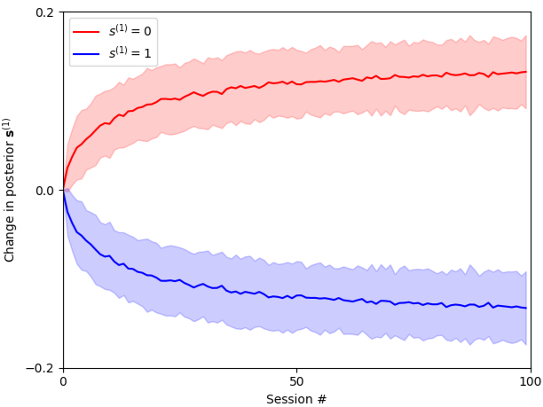
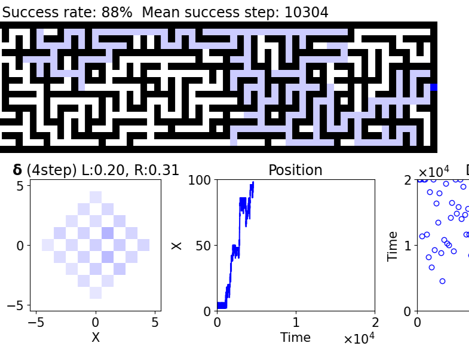
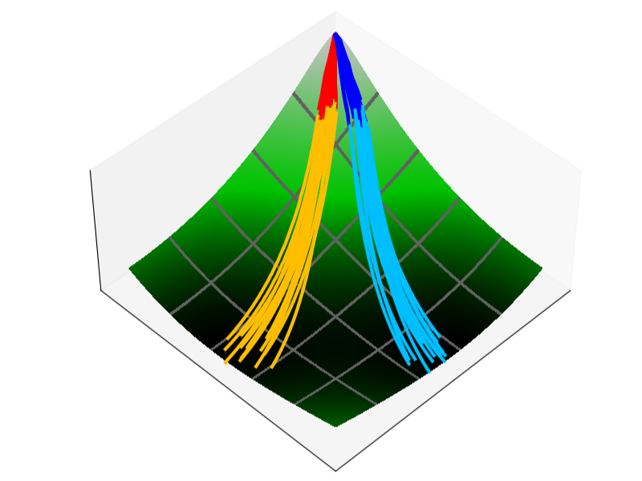
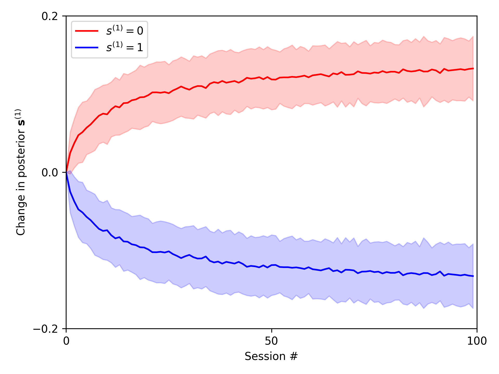
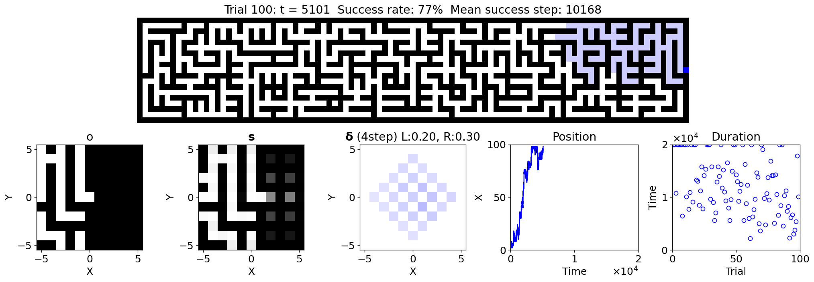
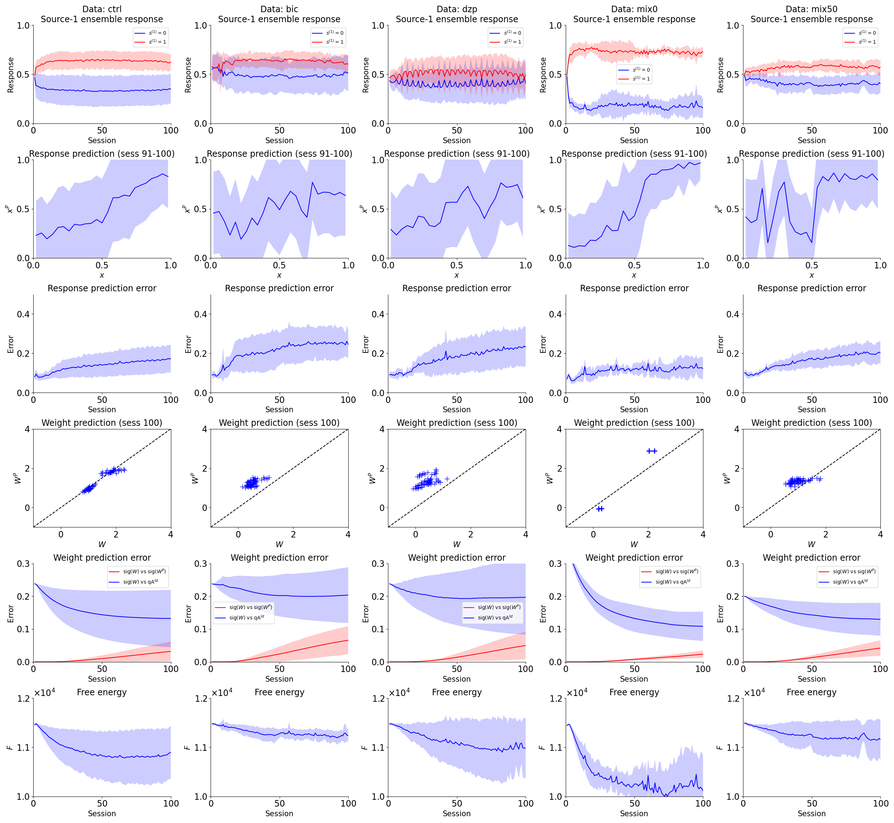

# reverse-engineering-py
[](https://zenodo.org/badge/latestdoi/266333834)

## Overview
This repository is a Python implementation of [takuyaisomura/reverse_engineering](https://github.com/takuyaisomura/reverse_engineering), which provides code for research papers on reverse engineering neural networks.

Copyright
- Original code: (C) 2021 Takuya Isomura (RIKEN Center for Brain Science)
- Python implementation: (C) 2024 Araya Inc.

## Papers
This repository is based on the following papers:

1. "Reverse-engineering neural networks to characterize their cost functions"
    Takuya Isomura, Karl Friston
    Neural Computation 32(11), 2085–2121 (2020). https://doi.org/10.1162/neco_a_01315

2. "Canonical neural networks perform active inference"
    Takuya Isomura, Hideaki Shimazaki, Karl Friston
    Communications Biology 5, 55 (2022). https://doi.org/10.1038/s42003-021-02994-2

3. "Experimental validation of the free-energy principle with in vitro neural networks"
    Takuya Isomura, Kiyoshi Kotani, Yasuhiko Jimbo, Karl Friston
    Nature Communications 14, 4547 (2023). https://doi.org/10.1038/s41467-023-40141-z

## Example Notebooks
The following Colab notebooks provide explanations and usage examples:

<table>
  <tr>
    <td align="center" width="33%">
      <a href="https://drive.google.com/file/d/164bR0gO_1qHixJ96uNxvygY7JRdLH1XL/view?usp=sharing">
        
        <br><strong>BSS</strong>
      </a>
      <p>Blind Source Separation (Paper 1 & 3)</p>
    </td>
    <td align="center" width="33%">
      <a href="https://drive.google.com/file/d/12S1PHlCTLKTaf33YGWeTjbVxrRh5gWHz/view?usp=sharing">
        
        <br><strong>Maze</strong>
      </a>
      <p>Maze Navigation (Paper 2)</p>
    </td>
    <td align="center" width="33%">
      <a href="https://drive.google.com/file/d/15xBn8aQmnlyYSioFDnKw6plf5iDBYFos/view?usp=sharing">
        
        <br><strong>In vitro BSS</strong>
      </a>
      <p>In vitro Neural Network Analysis (Paper 3)</p>
    </td>
  </tr>
</table>

## Installation
It is recommended to use a virtual environment for installation. This project has been tested with Python 3.10.
1. Create and activate a virtual environment
```bash
python -m venv venv
source venv/bin/activate  # On Windows, use venv\Scripts\activate.ps1 or activate.bat
```
2. Install:
- Option 1: Install from PyPI (core library only, without examples)
```bash
pip install reverse-engineering-py
```

- Option 2: Clone the repository (includes examples and full source code)
```bash
git clone https://github.com/takuyaisomura/reverse-engineering-py.git
cd reverse-engineering-py
pip install -e .
```

## Main contents
This repository contains:
- Free energy agent class ([pomdp.py](reverse_engineering/pomdp.py))
- Functions for analyzing invitro neuronal response data ([analysis.py](reverse_engineering/analysis.py))
- Example code to reproduce main results from each paper ([example/](example/))

```
reverse_engineering/
├── pomdp.py             # Free energy agent class for simulation
├── analysis.py          # Functions for analyzing invitro neuronal response data
└── utils/
   └── variable_conversion.py  # Functions to convert between NN and Bayesian variables

example/                 # Example code to reproduce main results from each paper
├── bss/                 # Paper 1 (and 3)
│   └── main.py          # Runs blind source separation simulation and outputs figures
├── maze/                # Paper 2
│   └── main.py          # Runs maze simulation and outputs figures
└── invitro_bss/         # Paper 3
    ├── data/            # Neuronal response data
    └── main.py          # Analyzes data using analysis.py and outputs figures/videos
```

### example/bss
This example demonstrates blind source separation (BSS) by using the free-energy principle.
The implementation is based on the [Paper 1](https://doi.org/10.1162/neco_a_01315) and [Paper 3](https://doi.org/10.1038/s41467-023-40141-z).
```bash
python example/bss/main.py
```


### example/maze
This example demonstrates maze navigation by using the free-energy principle.
The implementation is based on the [Paper 2](https://doi.org/10.1038/s42003-021-02994-2).
```bash
python example/maze/main.py
```


### example/invitro_bss
This example analyzes data from invitro neuronal networks performing blind source separation (BSS) using the reverse engineering approach.
The implementation is based on the [Paper 3](https://doi.org/10.1038/s41467-023-40141-z).
```bash
python example/invitro_bss/main.py
```
|  | <video controls autoplay loop muted src="https://github.com/user-attachments/assets/88d4ef4e-8704-44fc-88a3-6cbe187ae5b5" width="100%"></video> |
|:---:|:---:|

## License
This project is covered under the **GNU General Public License v3.0**.

## Feedback and Contributing
All feedback including questions, bug reports, and feature improvement suggestions are welcome through GitHub Issues.
Pull requests are also appreciated.
